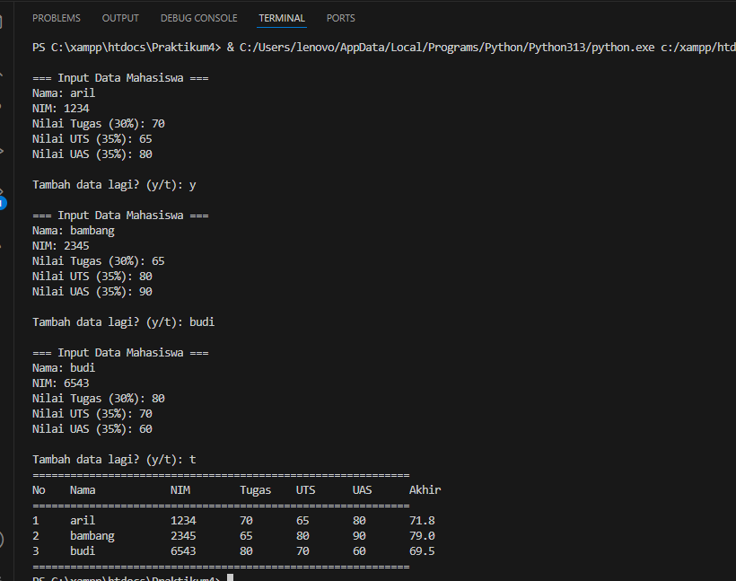
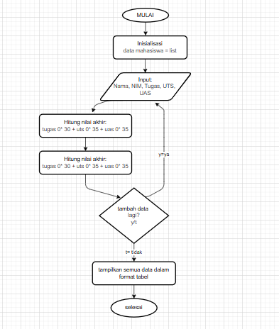

# NAMA   : AGUS SALEH RUMBOUW
# NIM    : 312510465
# KELAS  : TI.25.A.2
# MATKUL : Pengantar Pemrograman
## Penjelasa Pendataan Nilai Mahasiswa
### Diskripsi
Tugas ini di buat untuk menghitung nilai nilai akhir mahasiswa dengan menambahkan data mahasiswa (Nama, NIM, UTS, UAS, Nilai Tugas)
## Fitur Penjelasan
<pre><li>Menginput data mahasiswa dengan perulangan
<li>Perhitungan nilai akhir otomatis
<li>Penyimpanan data menggunakan list dan dictionary
<li>Tampilan output dalam format tabel yang rapi
<li>Konfirmasi untuk menambah data (y/t)</li></pre>
### perhitungan nilai akhir diambil menggunakan 3 kompunen yaitu :
<pre>(tugas: 30%, uts: 35%, uas: 35%)
<b>Dengan Rumus</b> :  Nilai Akhir = (Tugas × 30%) + (UTS × 35%) + (UAS × 35%)</pre>
### Cara Menggunaka
1. Jalankan program ini pada bagian terminal Visual Studio Code (VSC).
2. Masukan data mahsiswa seperti (NAMA, NIM, NILAI TUGAS, NILAI UTS,NILAI UAS).
3. Ketika sudah menjalankan pilih opsi y/t, Jika memilih "y" maka akan melanjutkan penginputan dan jika memilih "t" maka akan menghasilkan nilai akhir.
4. Contoh Output

### Bagian Flowcart 
    A([MULAI]) --> B[Data_mahasiswa = list]
    B --> C[/Input: Nama, NIM, Tugas, UTS, UAS/]
    C --> D[Hitung Nilai Akhir:   tugas×0.30 + uts×0.35 + uas×0.35]
    D --> E[Simpan ke data_mahasiswa]
    E --> F{Tambah data   lagi?   y/t}
    F -->|y = Ya| Lanjut
    F -->|t = Tidak| G[Tampilkan semua data   dalam format tabel]
    G --> H([SELESAI])
### Gambar Flowchart

## Praktikum4 Selesai
